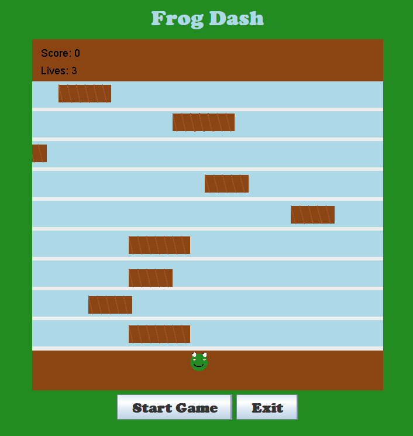

# Frog-Dash
COMP 3609 - A1

# 🐸 FROG DASH  
**By Annika Boodoosingh**  

Frog Dash is a fast-paced, reflex-testing arcade game featuring **Felix the Frog**, a daring little adventurer who loves leaping across the river near his home. But there’s a twist—dangerous logs and a ticking clock stand in his way!

---

## Game Concept

Join Felix as he races against time and dodges incoming logs to reach safe land. Every jump counts, and every second matters! Test your reflexes, earn points, and help Felix return home before dinner time.

---

## How to Play

- Use the **arrow keys** to move Felix: `↑ ↓ ← →`
- **Start Button**: Begins the game and activates the countdown timer.
- **Exit Button**: Closes the game at any time.
- **Replay Button**: Appears after game over to restart the game.

---

## Game Rules

- **Avoid Logs**: If Felix hits a log, he loses 1 life and 5 points (score never goes below 0).
- **Reach Land**: Gain **+50 points** for each successful crossing.
- **Boundaries**: Felix stays within the panel area.
- ⏱**Timer**: Game lasts **30 seconds** or ends when 3 lives are lost.

---

## Game Over

- A message displays when time runs out or all lives are lost.
- Players can hit **Replay** to start over with:
  - **Score reset to 0**
  - **Lives reset to 3**

---

## Preview 

<p align="center">
  
</p>
---

## Tech Stack

- Java (Swing GUI)
- Object-Oriented Programming
- Event Handling & Timers

---

## Getting Started

1. Clone or download the repository.
2. Compile and run the main class:

```bash
javac GameApplication.java
java GameApplication
